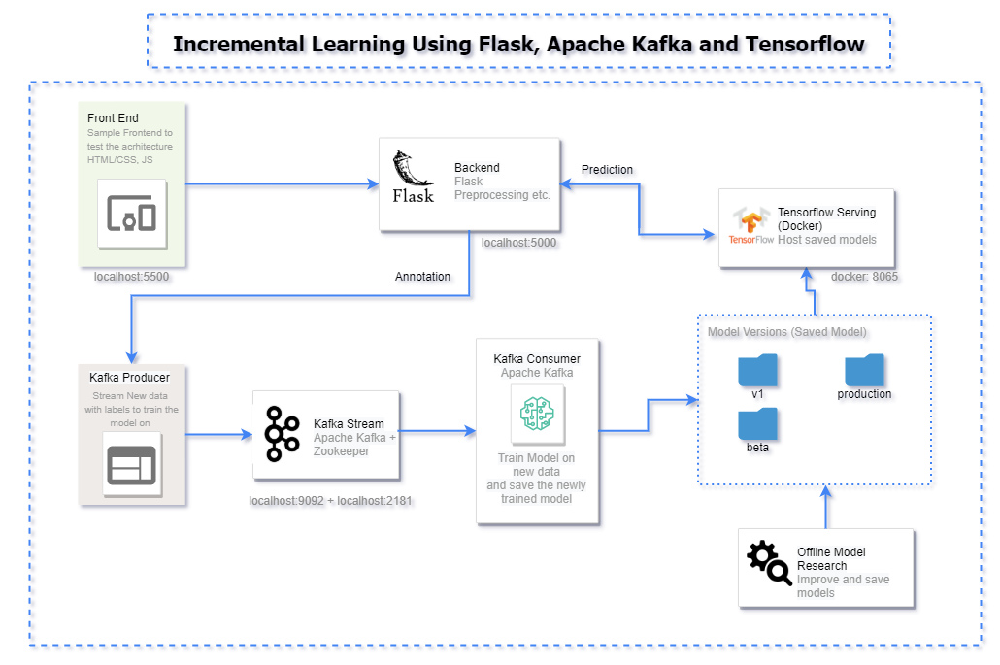

# Incremental Model 
## Description
Developed a Microservice based architecture having 5 different components
1. Frontend (Simple HTML/CSS + JS website to test the architecture)
2. Backend (Flask, Kafka Producer)
3. Kafka Cosnsumer (Python script to consume new data and train and save model) 
4. Tensorflow Serving on Docker (Docker)
5. Saved Models (Folder having different saved versions of the model, used by Tensorflow serving to provide a API)
 
> All the components interact together in a way shown below:

## ML in practice
The online machine learning paradigm is a bit different from the traditional/conventional way of training machine learning models.
- In traditional approaches the dataset is fixed and the model iterates over it n number of times. 
- In online learning, the model continues to incrementally learn/update it's parameters as soon as the new data points are available and this process is expected to continue indefinitely. 

## References

- [Python Kafka Library](https://kafka-python.readthedocs.io/en/master/usage.html)
- [Tensorflow Online Learning](https://www.tensorflow.org/io/tutorials/kafka#online_learning)
- [Using Docker for Serving Tensorflow](https://www.youtube.com/watch?v=P-5sMcpTE0g)
